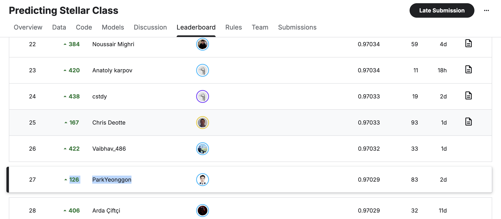

# Kaggle Predicting Stellar Class

## 🏆 최종 순위: 27th / 2,824 Teams · 상위 1%

> **Private leaderboard 0.97029 · Final rank 27 · OOF balanced accuracy 0.9706589608**

Kaggle Playground Series Season 6 Episode 6 `Predicting Stellar Class` 대회에서
2,824팀 중 27등(상위 1%)을 기록한 연구 저장소입니다.



최종 제출은 public leaderboard 점수가 아니라 OOF/CV 안정성으로 선택했습니다.
public 최적화 reference는 public 0.97254였지만 private 0.97005로 하락했습니다.
반면 최종 일반화 후보는 private 0.97029를 기록하며 최종 27위에 올랐습니다.

| Track | Selection criterion | Public | Private |
|---|---|---:|---:|
| Final generalization | OOF/CV, class recall, subset stability | - | **0.97029** |
| Public reference | Public submission consensus | **0.97254** | 0.97005 |

이 결과는 작은 public leaderboard 상승보다 반복 OOF 검증과 보수적인 후보 선택이
숨겨진 private test에서 더 안정적이었다는 것을 보여줍니다.

## Competition

천체 관측치를 다음 세 class로 분류하는 다중 분류 문제입니다.

- `GALAXY`
- `QSO`
- `STAR`

평가지표는 balanced accuracy입니다. 데이터가 많은 class의 정확도만 높이는 것이
아니라, 세 class의 recall을 고르게 높여야 합니다.

```text
balanced accuracy
= (GALAXY recall + QSO recall + STAR recall) / 3
```

## Final Generalization Method

최종 파일은 `outputs/193_PRIVATE_CV_oof970659.csv`입니다.

193번은 하나의 대형 모델을 그대로 제출한 결과가 아닙니다. LightGBM, XGBoost,
CatBoost, one-vs-rest CatBoost, fold-safe target encoding, RealMLP 계열 등의
OOF/test probability를 연구 재료로 사용하고, 이전 안정 후보 위에 작은 보정을
누적했습니다.

```text
95   OOF 0.9706450214
171  OOF 0.9706515037
181  OOF 0.9706563117
193  OOF 0.9706589608
```

마지막 단계에서는 one-vs-rest CatBoost의 GALAXY 확률을 0.5%만 추가했습니다.

```text
new_GALAXY = 0.995 * current_GALAXY
           + 0.005 * OVR_CatBoost_GALAXY
```

이 변화로 181번 대비 train 예측 3행과 test 예측 1행만 달라졌습니다. 보조 모델의
단독 OOF는 최종 후보보다 낮았지만, GALAXY 경계에서 기존 후보와 다른 정보를
제공했기 때문에 작은 가중치에서 개선이 발생했습니다.

후보 선택 과정은 다음과 같습니다.

1. 24개의 OOF/test probability source를 수집했습니다.
2. class-wise blend, subset rollback, selective transfer로 1,199개 후보를 만들었습니다.
3. OOF와 class recall, 취약 subset, 변경 row 수로 상위 120개를 선별했습니다.
4. 10 seeds × 5 folds의 50개 meta validation 구간에서 안정성을 다시 검사했습니다.
5. raw OOF가 조금 더 높아도 변경량과 subset 손실이 큰 후보는 제외했습니다.

최종 193번은 기준 후보와 비교한 50개 meta-fold 모두에서 양의 delta를 기록했습니다.

```text
mean meta-fold delta   +0.0000863677
min meta-fold delta    +0.0000102667
positive fold rate      1.0
```

## OOF Class Performance

최종 OOF confusion matrix 기준 class recall은 다음과 같습니다.

```text
GALAXY  0.960276
QSO     0.977207
STAR    0.974493
```

전체 OOF만 높이고 특정 class를 희생한 후보를 피하기 위해 class별 recall과
spectral type, galaxy population, redshift, color index, magnitude 구간의
subset 성능을 함께 확인했습니다.

## Repository Structure

```text
.
├── data/                         competition train/test data
├── external_preds/               public prediction research bank
├── external_sources/             imported notebook and source references
├── src/                           shared feature engineering
├── scripts/                       training, OOF stacking, audit scripts
├── artifacts/                     model probabilities, reports, graphs
├── outputs/                       submission candidates
├── research_private_generalization_20260619/
│   └── daily/                     dated metrics, figures, notes, blog drafts
└── kaggle_share_20260701/         post-competition sharing notebook and article
```

`data/`, probability arrays, model artifacts는 용량과 Kaggle 데이터 이용 조건 때문에
Git 저장 대상에서 제외될 수 있습니다.

## Core Scripts

### Model training

- `scripts/train_lgbm_cv.py`: LightGBM OOF/test probability
- `scripts/train_xgboost_cv.py`: XGBoost OOF/test probability
- `scripts/train_catboost_cv.py`: CatBoost OOF/test probability
- `scripts/train_ovr_catboost_cv.py`: class별 one-vs-rest CatBoost
- `scripts/train_ovr_xgboost_cv.py`: class별 one-vs-rest XGBoost
- `scripts/train_lgbm_foldsafe_te_cv.py`: fold-safe target encoding LightGBM
- `scripts/train_repleafgbm_cv.py`: ReplEAFGBM 실험

### Generalization research

- `scripts/optimize_oof_generalization_stack.py`: OOF 기반 stack weight 탐색
- `scripts/optimize_classwise_research_blend.py`: class별 probability blend
- `scripts/build_robust_private_cv_next_candidates.py`: robust 후보 생성 및 선별
- `scripts/audit_private_candidate_evidence.py`: fold/class/subset 안정성 감사
- `scripts/build_final_private_submission.py`: 최종 private 후보 검증 및 보관
- `scripts/evaluate_sdss_external_generalization.py`: SDSS 외부 일반화 검사

### Public-track research

- `scripts/analyze_submission_bank.py`: 공개 submission disagreement 분석
- `scripts/build_bank_ridge_flip_candidates.py`: ridge flip 후보 생성
- `scripts/analyze_public_097252_reference.py`: public 고득점 reference 분석
- `scripts/build_advanced_ridge_v3_candidates.py`: public consensus 실험

Public-track 산출물은 일반화 후보와 분리해 관리했으며, 최종 private 후보의 선택
점수로 사용하지 않았습니다.

## Reproduce the Final Selection Stage

대회 종료 후 공개한 노트북은 181번에서 193번으로 이어지는 마지막 선택 단계를
재현합니다.

- `kaggle_share_20260701/27th-place-robust-oof-selection.ipynb`
- `kaggle_share_20260701/kaggle_discussion_post_en.md`
- `kaggle_share_20260701/kaggle_upload_steps_ko.md`

필요한 probability dataset을 준비하고 노트북을 실행하면 다음 결과가 재현됩니다.

```text
OOF balanced accuracy  0.9706589608
positive fold rate     1.0
changed train rows     3
changed test rows      1
```

생성되는 submission은 실제 193번 파일과 같은 SHA-256을 가집니다.

```text
fb02a1248ed7cda8d0eebe9fa3a88d37a752f619fe713bd85a8cf37948780c31
```

노트북은 최종 선택 단계를 재현하며, 24개 source 전체를 처음부터 다시 학습하는
짧은 코드라고 주장하지 않습니다. 사전 계산된 OOF/test probability의 사용 범위와
공개 source 의존성을 노트북에 명시했습니다.

## Setup

```bash
python3 -m venv .venv
source .venv/bin/activate
pip install -r requirements.txt
```

Kaggle competition data는 다음 경로에 배치합니다.

```text
data/train.csv
data/test.csv
data/sample_submission.csv
```

기본 단일 모델 학습 예시는 다음과 같습니다.

```bash
python scripts/train_lgbm_cv.py
python scripts/train_xgboost_cv.py
python scripts/train_catboost_cv.py
```

최종 공유 노트북의 입력 자료를 구성하려면 다음을 실행합니다.

```bash
python scripts/package_kaggle_share_20260701.py
python kaggle_share_20260701/build_notebook.py
```

## Research Archive

날짜별 실험 수치, 그래프, 제출 후보와 블로그 초안은 다음 위치에 보관합니다.

```text
research_private_generalization_20260619/daily/
```

최종 결과 정리는 다음 문서에서 확인할 수 있습니다.

- `research_private_generalization_20260619/daily/2026-06-24/blog_2026-06-24_private_193.md`
- `research_private_generalization_20260619/daily/2026-07-01/blog_2026-07-01_final_result.md`

## Notes

- Competition data와 대용량 model artifact는 Git에 직접 포함하지 않습니다.
- 공개 notebook과 OOF/test prediction을 사용한 부분은 원본 작성자를 명시합니다.
- public leaderboard score와 private/generalization 성능을 같은 신호로 취급하지 않습니다.
- 최종 결과를 만들지 못한 실험도 재현성과 연구 기록을 위해 날짜별로 남겼습니다.
