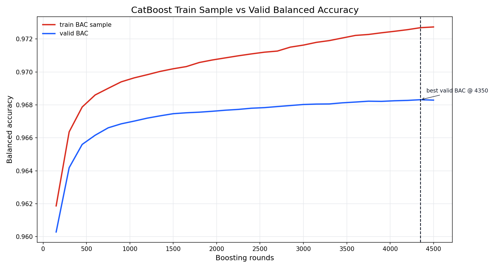
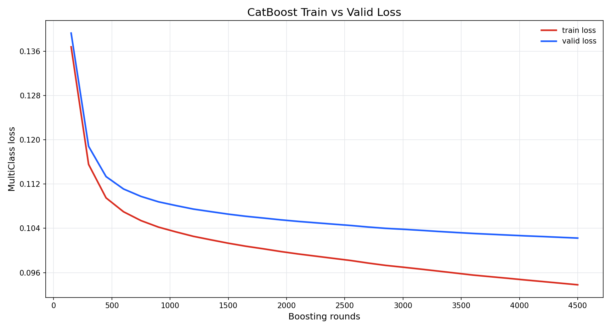
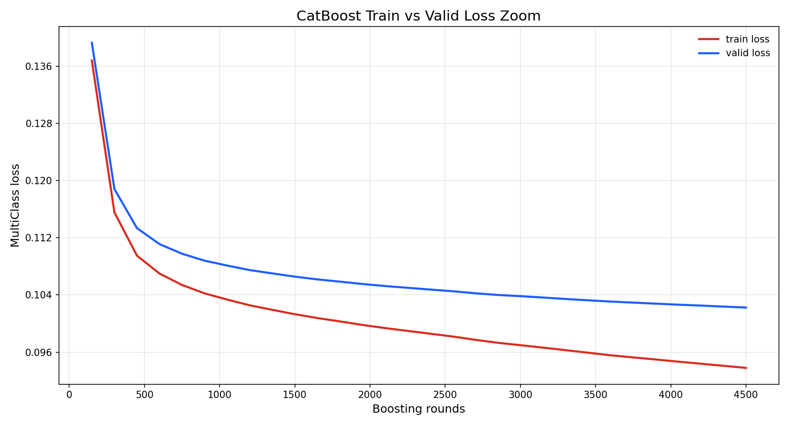
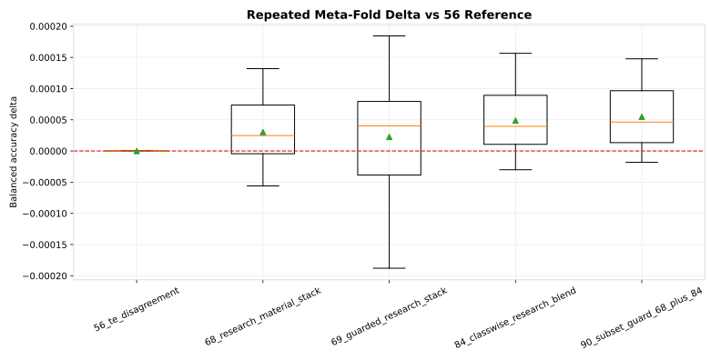

# 2026-06-21 연구 기록

이날부터는 방향을 다시 잡았습니다. public leaderboard 점수만 따라가면 당장은 순위가 좋아 보일 수 있지만, 이 대회는 최종적으로 private set이 따로 있고, public set은 전체 test의 일부일 뿐입니다. 그래서 public이 조금 내려가더라도 OOF/CV가 올라가고 fold별로 반복되는 이득이 있으면 private 후보로 유지하기로 했습니다. 반대로 public이 좋아도 OOF 근거가 약하면 최종 후보로는 조심스럽게 봤습니다.

가장 먼저 다시 본 것은 CatBoost v3 스타일의 categorical view였습니다. 상위권 CatBoost 노트북은 단순히 CatBoost를 실행한 것이 아니었습니다. 숫자 feature를 그대로 쓰는 대신, magnitude를 반올림하거나 floor category로 바꾸고, 색지수와 redshift를 구간화하고, color-redshift 조합을 범주형 feature로 만들어 CatBoost가 경계 구간을 더 잘 보게 했습니다. 이 방식은 우리가 이전까지 쓰던 순수 수치 feature 중심의 GBDT와 다릅니다. 특히 천문 데이터에서는 u, g, r, i, z magnitude 자체보다 band 사이의 차이와 redshift가 결합된 형태가 class 경계를 더 잘 설명할 수 있습니다.

그래서 catv3 feature set을 만들고 CatBoost를 다시 돌렸습니다. 이때부터 학습을 보는 기준도 바꿨습니다. 이전에는 logloss가 계속 내려가면 더 학습하는 것이 좋아 보였습니다. 하지만 대회 지표는 logloss가 아니라 balanced accuracy입니다. logloss는 확률 보정이 좋아지는 방향으로 계속 내려갈 수 있지만, 최종 제출은 가장 높은 확률 class 하나로 결정됩니다. 즉, logloss가 내려가도 class decision boundary가 private 성능에 유리해진다고 장담할 수 없습니다.

balanced accuracy 그래프를 보면 train sample BAC는 꾸준히 올라갑니다. validation BAC도 4500 round 근처까지 조금씩 올라가기는 합니다. 하지만 두 곡선의 간격은 계속 벌어집니다. 이 그래프만 보면 “아직 validation도 오르니까 더 돌려도 된다”라고 볼 수도 있지만, 동시에 train 쪽은 훨씬 빠르게 좋아지고 있습니다. 그래서 이 모델은 직접 제출용 최고 모델이라기보다, 스태킹 재료로 쓸 때 가치가 있는지 봐야 한다고 판단했습니다.

logloss 그래프는 더 분명했습니다. train loss와 valid loss가 둘 다 계속 내려갑니다. 하지만 valid loss가 내려가는 동안에도 train-valid gap은 커집니다. 예전부터 계속 헷갈렸던 지점이 여기였습니다. CatBoost 내부의 bestIteration은 logloss 기준으로는 뒤쪽을 가리킬 수 있습니다. 그러나 우리에게 필요한 것은 logloss 최저점이 아니라 validation balanced accuracy가 좋은 지점입니다. 그래서 이후에는 chunk 단위로 학습하면서 global iteration 기준 BAC를 따로 기록하고, 최고 BAC 지점의 예측을 저장하는 로직이 필요하다고 정리했습니다.

결과적으로 CatBoost catv3 direct 후보의 OOF balanced accuracy는 0.968334였습니다. 이 수치는 완전히 나쁜 것은 아니지만, 당시 우리가 가지고 있던 private 후보 56번과 68번보다 낮았습니다. 즉, 이 모델을 그대로 최종 제출로 쓰는 것은 맞지 않았습니다. 대신 중요한 질문은 따로 있었습니다. 전체 OOF는 낮아도 특정 subset에서 기존 후보가 틀리는 row를 맞히는가. 특정 class recall을 보강하는가. 기존 stacker와 disagreement가 생기는 지점이 의미 있는가. 이 질문에 답해야 했습니다.

이날 만든 candidate audit은 그래서 중요했습니다. 후보를 하나씩 public 제출해보는 방식이 아니라, 후보별 OOF balanced accuracy, 56번 대비 delta, 변경 row 수, worst subset, best subset, meta-fold positive rate를 같이 보게 만들었습니다.

후보별 OOF 그래프에서는 56번 TE disagreement 후보가 기준점이었고, 이후 68, 69, 84, 90 후보가 순서대로 위로 올라왔습니다. 56번은 OOF 0.970572였고, 68번 research material stack은 0.970603, 84번 classwise research blend는 0.970621, 90번 subset guard union은 0.970627까지 올라갔습니다. 숫자만 보면 90번이 가장 좋습니다. 하지만 이 작은 차이는 대회 public 점수에서 바로 보이지 않을 수도 있습니다. balanced accuracy는 class별 recall 평균이고, public 표시 소수점도 제한되어 있기 때문입니다.

meta-fold delta 그래프는 후보의 안정성을 보는 용도였습니다. 평균 delta가 좋아도 fold 중 일부에서 손실이 크면 private 후보로 위험합니다. 90번은 평균적으로 가장 좋았지만 모든 구간에서 완전히 무손실은 아니었습니다. 69번은 public 점수는 0.97103으로 좋아 보였지만, O/B Red Sequence 같은 subset에서 손실이 컸고 변경 row 수도 많았습니다. 그래서 public이 조금 더 좋다고 바로 private 후보로 올리면 안 된다는 결론이 나왔습니다.

이날의 핵심은 모델 하나를 더 만든 것이 아니라, 판단 체계를 바꾼 것입니다. CatBoost catv3 feature는 직접 제출용으로는 낮았지만, 스태킹 재료로 남겼습니다. logloss만 보고 학습을 끌고 가지 말고, validation balanced accuracy와 OOF를 따로 보도록 기준을 세웠습니다. 그리고 후보를 고를 때 public 점수 하나가 아니라 class recall, subset delta, meta-fold 안정성을 같이 보게 만들었습니다.

정리하면 이날은 “점수가 오른 파일”을 찾은 날이라기보다 “왜 오르는지 확인하는 장치”를 만든 날이었습니다. 이후 68, 84, 90, 193 같은 후보를 판단할 수 있었던 것도 이때부터 OOF와 subset 분석을 같은 화면에서 보기 시작했기 때문입니다.
