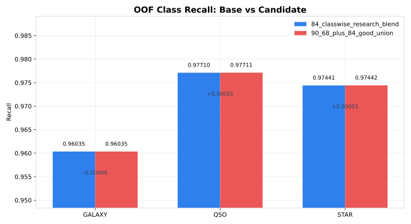
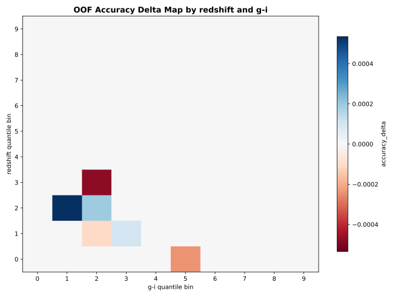
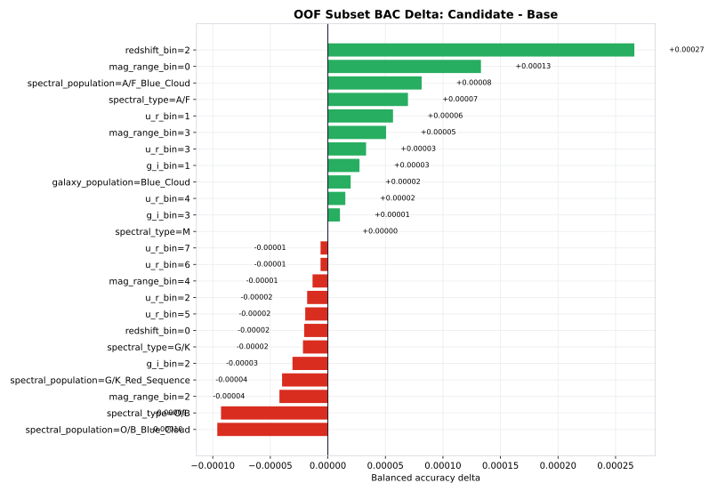
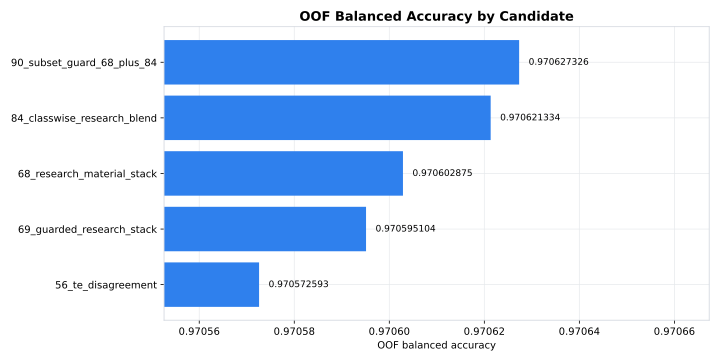

# 2026-06-23 연구 기록

이날은 그동안 만든 연구 재료를 다시 stacker 안으로 넣은 날이었습니다. 이전까지는 직접 학습 모델이나 prediction bank source를 주로 섞었습니다. 그런데 56번 TE disagreement 후보, 68번 research material stack, 84번 classwise research blend, 90번 subset guard 후보 자체도 이미 OOF/test prediction을 가진 하나의 source처럼 볼 수 있었습니다. 그래서 단일 모델만 재료로 보는 것이 아니라, 우리가 만든 private 후보들도 다시 재료로 사용하는 방향으로 넘어갔습니다.

시작점은 56번 후보였습니다. 56번은 OOF 0.970573으로, 높은 g-i와 낮은 redshift 영역에서 fold-safe TE LightGBM이 기존 stacker와 다르게 판단한 row를 제한적으로 반영한 후보였습니다. 단독 모델이 강해서 올라간 것이 아니라, 약한 모델이라도 특정 경계 row에서는 추가 정보를 준다는 점이 핵심이었습니다. 이 구조가 이날 이후 연구의 기본 가정이 됐습니다.

68번 research material stack은 56번보다 한 단계 더 나아간 후보였습니다. 기존 prediction bank와 우리 직접 학습 source만 보는 것이 아니라, 56번 같은 연구 후보 자체를 stack 재료로 넣었습니다. 결과적으로 68번은 OOF 0.970603까지 올라갔습니다. public은 0.97096으로 크게 반응하지 않았지만, OOF 기준으로는 56번 대비 약 0.000030 상승했습니다. 이 차이는 작아 보이지만, 이 대회에서 57만 row의 OOF balanced accuracy를 올리는 기준으로 보면 의미 있는 변화였습니다.

이후 84번 classwise research blend를 만들었습니다. 68번을 시작점으로 두고 STAR class 쪽에서 available catv3, classwise blender, 69 guarded stack을 아주 낮은 alpha로 섞었습니다. accepted stage를 보면 available_catv3 STAR 0.07, classwise_blender_c010 STAR 0.035, 69_guarded_research_stack STAR 0.01이 순서대로 채택되었습니다. 이 과정을 거쳐 84번은 OOF 0.970621까지 올라갔습니다. 여기서 중요한 것은 weight가 크지 않다는 점입니다. 강한 모델 하나를 통째로 섞은 것이 아니라, 특정 class의 확률만 아주 작게 보정했습니다.

84번과 68번의 class recall을 비교하면 변화가 매우 작습니다. GALAXY recall은 68번 0.960310에서 84번 0.960350으로 조금 올라갔고, QSO recall은 0.977113에서 0.977105로 거의 유지됐습니다. STAR recall은 0.974385에서 0.974409로 올라갔습니다. 큰 변화는 아니지만, 세 class 중 특정 하나를 크게 망가뜨리지 않고 OOF를 올렸다는 점이 중요했습니다. 이때부터 “작은 classwise blend”가 안정적인 개선 방법일 수 있다고 봤습니다.

그 다음 만든 것이 90번 subset guard 후보였습니다. 90번은 68번과 84번의 좋은 부분을 union 형태로 묶되, subset 손실이 너무 큰 구간은 막는 방식이었습니다. OOF는 0.970627까지 올라갔습니다. 이 수치만 보면 90번이 가장 좋았습니다. 그러나 public score는 84번과 마찬가지로 0.97096이었습니다. public 점수가 같다고 같은 후보는 아니었습니다. OOF와 class recall, subset delta를 보면 내부 구조가 다릅니다.

90번과 84번의 class recall 비교에서는 거의 차이가 없습니다. GALAXY recall은 둘 다 약 0.96035, QSO recall도 0.97710에서 0.97711 수준, STAR recall도 0.97441에서 0.97442 수준입니다. 이 그래프만 보면 “둘이 같은 것 아닌가”라는 생각이 듭니다. 하지만 balanced accuracy가 조금 오른 이유는 class 전체 평균이 아니라, 일부 subset에서 맞고 틀리는 row가 바뀌었기 때문입니다. 그래서 class 단위 그래프만으로는 부족하고 subset map을 같이 봐야 했습니다.

redshift와 g-i quantile bin으로 나눈 delta map은 row-level patch의 성격을 보여줍니다. 전체 class recall은 거의 같아도, 특정 redshift/g-i 조합에서는 90번이 84번보다 낫고, 다른 조합에서는 손실이 있습니다. 이 지도에서 중요한 것은 “어디서 좋아졌는가”보다 “좋아진 영역과 나빠진 영역이 섞여 있다”는 사실이었습니다. 즉, 90번은 public에 바로 반응하지 않을 수 있지만 private에서 다른 분포를 만나면 84번과 다른 결과를 낼 수 있는 후보였습니다.

subset delta 그래프에서는 이 차이가 더 명확했습니다. 90번은 O/B Blue Cloud, O/B spectral type, 일부 mag_range_bin, redshift_bin에서 이득을 얻었습니다. 반대로 u_r_bin 6, u_r_bin 7, spectral_type M, 일부 g_i_bin에서는 손실이 있었습니다. 후보 audit summary에서도 90번의 worst subset은 u_r_bin=6으로 약 -0.000666 손실이 있었고, best subset은 u_r_bin=0으로 약 +0.001689 이득이 있었습니다. 이 숫자가 말해주는 것은 단순합니다. 90번은 전체 OOF는 가장 높지만 완전히 안전한 후보는 아니었습니다.

후보별 OOF 그래프를 보면 56, 69, 68, 84, 90 순서로 점수가 올라갑니다. 56번은 0.970573, 69번은 0.970595, 68번은 0.970603, 84번은 0.970621, 90번은 0.970627입니다. 이 흐름은 우리가 단순히 public 점수 높은 csv를 복사한 것이 아니라, OOF source를 하나씩 추가하면서 내부 검증 점수를 올렸다는 증거였습니다. 다만 69번은 public이 0.97103으로 더 좋게 나왔지만, OOF와 subset 안정성에서는 84/90보다 조심스럽게 봐야 했습니다.

meta-fold delta box 그래프는 후보 선택을 더 어렵게 만들었습니다. 평균적으로는 90번이 좋지만 fold별 분포를 보면 음수 delta가 남아 있습니다. 90번의 positive rate는 0.90으로 높았지만, minimum delta는 약 -0.000018이었습니다. 84번은 positive rate가 0.82였고 minimum delta는 약 -0.000030이었습니다. 68번은 positive rate가 0.64로 낮았습니다. 이 차이를 보고 90번을 private 최종 후보로 바로 확정하기보다, 이후 robust candidate scan에서 다시 검증하기로 했습니다.

이날 public 제출 결과도 중요했습니다. 68번과 84번, 90번은 public에서 모두 0.97096 근처로 비슷하게 보였습니다. 이것은 public score가 후보의 미세한 OOF 차이를 잘 보여주지 못한다는 뜻이었습니다. public은 확인용이지 최종 판단 기준이 아니었습니다. public이 같아도 OOF와 subset 구조가 다르면 private 기대값은 다를 수 있습니다.

결론적으로 23일의 핵심은 “연구 후보 자체를 다시 재료화했다”는 점입니다. 직접 모델, 공개 OOF bank, 우리가 만든 guarded 후보를 모두 source로 두고, classwise blend와 subset guard를 결합했습니다. 그 결과 90번이 OOF 0.970627로 그 시점 최고가 되었지만, subset 손실과 fold delta 때문에 최종 선택은 보류했습니다. 이 판단이 이후 193번 후보를 고르는 과정으로 이어졌습니다.

이날 느낀 점은 꽤 분명했습니다. public 점수 하나만 보고 있으면 68, 84, 90이 거의 같은 파일처럼 보입니다. 하지만 OOF와 그래프를 같이 보면 세 후보는 다른 후보입니다. public이 같은데도 내부 구조가 다르면, private에서는 다른 결과가 나올 수 있습니다. 그래서 최종 후보를 고를 때는 반드시 OOF score, class recall, redshift/g-i map, subset delta, meta-fold delta를 함께 봐야 한다고 정리했습니다.
