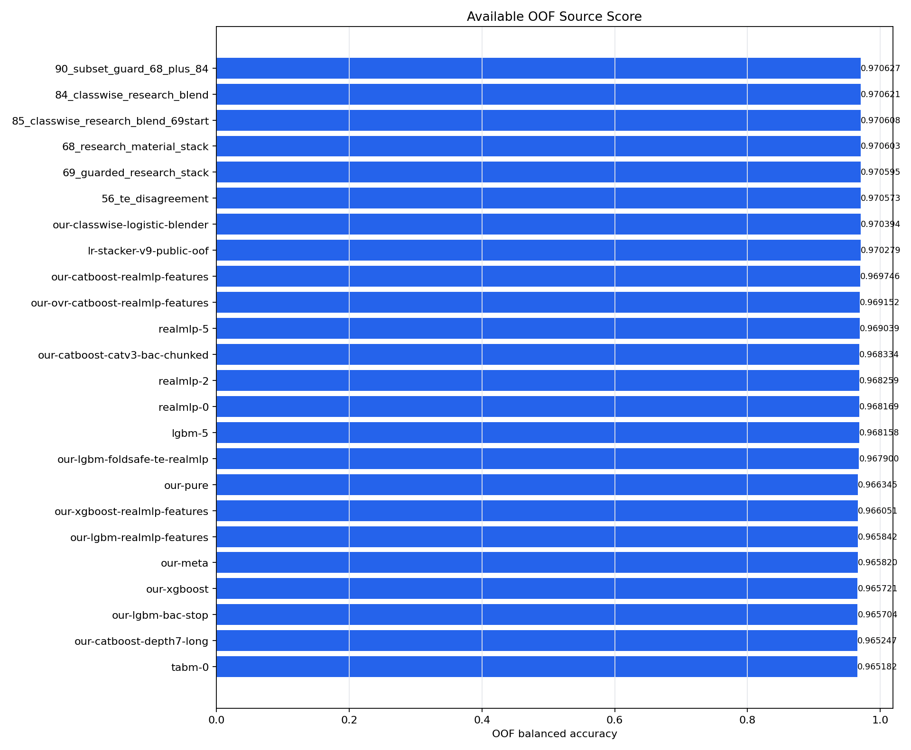
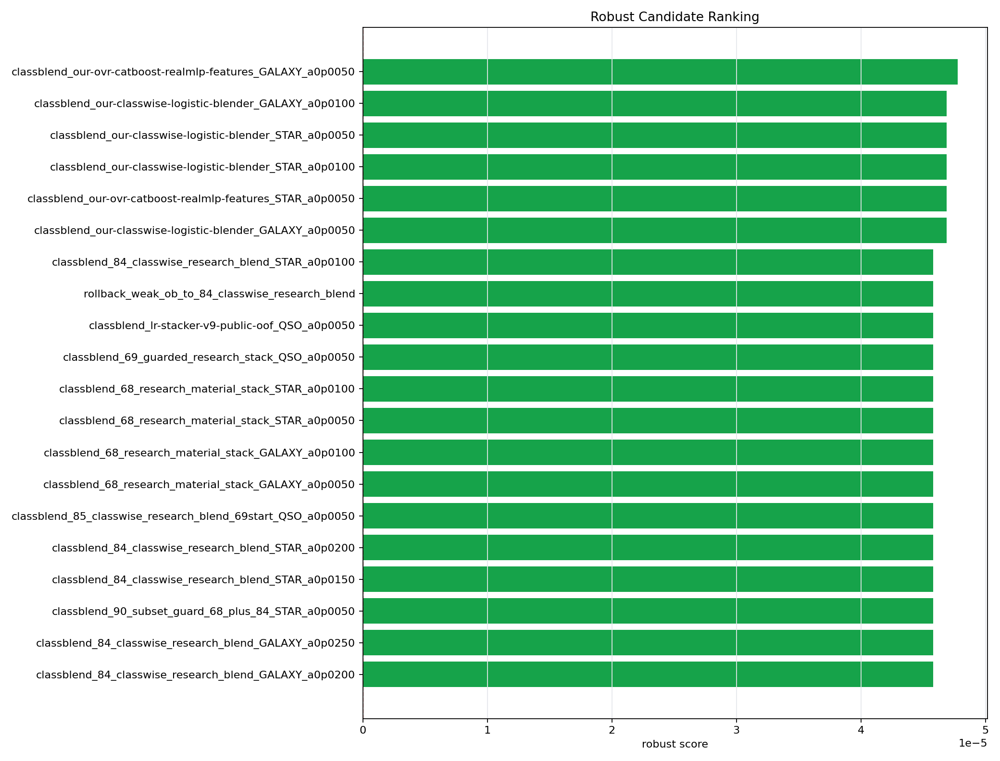

# 2026-06-24 연구 기록

이날은 public용 탐색과 private용 후보 선택을 완전히 분리해서 본 날이었습니다. 그 전날까지는 private OOF를 올리는 후보들을 만들었고, public score는 확인 정도로만 봤습니다. 그런데 public leaderboard에서는 다른 참가자들이 계속 blending으로 점수를 올리고 있었고, 우리 public 점수도 한 번은 업데이트해볼 필요가 있었습니다. 그래서 public 전용 실험을 따로 하고, private 최종 후보 선택은 OOF/CV 기준으로 다시 진행했습니다.

public 쪽에서는 0.97227 ridge consensus 계열을 기준으로 삼았습니다. 여기에 private 후보가 동의하는 row, 특정 transition, sg-only 계열 rank를 붙이는 방식으로 탐색했습니다. 처음에는 top15, top16, top20, top21, top22, top23처럼 rank 수를 늘려가며 제출했습니다. 결과는 꽤 선명했습니다. top15와 top16은 0.97231, top20은 0.97232, top21과 top22는 0.97233까지 올라갔습니다. 하지만 top23은 0.97229로 떨어졌습니다.

이 결과는 public 전용 실험의 한계를 보여줬습니다. top21 또는 top22까지는 public set에 맞는 row가 포함됐지만, top23부터는 틀린 row가 섞인 것으로 보입니다. 즉 public을 더 올리는 데는 row-level probing이 먹히지만, 이 방식은 private 일반화를 보장하지 않습니다. 그래서 public 후보는 public 후보로 따로 두고, private 후보와 섞지 않기로 했습니다.

public 최종 후보는 0.97233 계열이었습니다. 구체적으로는 sg-only rank top21 또는 top22가 가장 좋았습니다. 하지만 이것은 public leaderboard용 후보였습니다. private 후보로 착각하면 안 됩니다. public 탐색에서 얻은 정보는 “특정 STAR/GALAXY 경계 row가 public에서 유리했다”는 정도이지, private test에서도 같은 방향이 맞는다는 보장은 없습니다.

private 쪽에서는 90번 이후 후보를 다시 robust scan했습니다. 90번은 OOF 0.970627로 높았지만, u_r_bin 일부에서 손실이 있었고 meta-fold minimum delta가 음수였습니다. 그래서 90번을 그대로 최종 후보로 두기보다, 95번 이후, 171번 이후, 181번 이후처럼 단계적으로 weak subset rollback과 classwise blend를 다시 적용했습니다.

source OOF score 그래프를 보면 이미 연구 후보들이 단일 모델보다 위에 올라와 있습니다. 90_subset_guard_68_plus_84가 0.970627, 84_classwise_research_blend가 0.970621, 68_research_material_stack이 0.970603, 69_guarded_research_stack이 0.970595, 56_te_disagreement가 0.970573입니다. 그 아래에는 our-classwise-logistic-blender, lr-stacker-v9-public-oof, our-catboost-realmlp-features, our-ovr-catboost-realmlp-features, realmlp-5 등이 이어집니다.

이 그래프에서 중요한 점은 단일 모델 하나가 아니라, “연구 후보 자체가 source가 되었다”는 점입니다. CatBoost RealMLP feature나 RealMLP source는 여전히 중요한 재료였지만, 그 자체보다 68, 84, 90처럼 여러 source를 OOF 기준으로 조합한 후보가 더 높은 위치에 있었습니다. 그래서 이날의 연구는 새로운 단일 모델을 하나 더 만드는 것이 아니라, 이미 올라온 후보 위에서 어떤 작은 classwise 보정이 private 안정성을 더 높이는지 보는 방향이었습니다.

robust candidate ranking 그래프에서는 193번 후보에 해당하는 `our-ovr-catboost-realmlp-features`의 GALAXY classblend가 가장 위에 있었습니다. 막대 차이가 아주 크지는 않았지만, OOF, reference 대비 delta, start 대비 delta, changed row 수, worst subset 손실, meta-fold positive rate를 종합했을 때 가장 균형이 좋았습니다. 이 후보는 OOF 0.970659였습니다.

이때 192번 후보도 같이 봤습니다. 192번은 rollback_weak_gi2_to_69_guarded_research_stack 계열로 OOF 0.970664까지 올라갔습니다. 숫자만 보면 192번이 더 높았습니다. 하지만 192번은 aggressive 후보였습니다. reference 대비 changed row가 303개였고, test changed row도 130개였습니다. worst subset과 worst class recall 손실도 더 컸습니다. OOF 숫자만 보면 좋아 보이지만, private 안정성 관점에서는 너무 많은 row를 건드린 후보였습니다.

반면 193번은 OOF가 0.970659로 192번보다 아주 조금 낮았지만, start 대비 변경 row가 3개에 불과했고, test changed row도 1개였습니다. reference 대비로는 192개 정도 차이가 있지만, 직전 안정 후보에서 아주 작은 classwise 보정만 추가한 형태였습니다. meta-fold positive rate도 reference 대비 1.0이었습니다. 즉, 모든 meta-fold에서 reference보다 나아졌다는 뜻입니다. start 대비 positive rate는 0.5였지만, start 대비 변화 자체가 매우 작기 때문에 과한 공격으로 보기는 어려웠습니다.

class report도 193번 선택을 뒷받침했습니다. 193번의 GALAXY recall은 0.960276, QSO recall은 0.977207, STAR recall은 0.974493이었습니다. 192번은 GALAXY recall 0.960393, QSO recall 0.977105, STAR recall 0.974493으로 GALAXY 쪽은 조금 더 좋아 보였지만, subset 손실이 더 컸습니다. 특히 weak_gk_red와 weak_ur6 같은 구간의 손실을 같이 봐야 했습니다. 우리는 private에서 특정 subset이 크게 무너지는 후보보다, OOF 상승 폭은 조금 작아도 robust score가 좋은 후보를 최종 private 후보로 보는 쪽이 맞다고 판단했습니다.

이날 최종적으로 public 후보와 private 후보를 분리했습니다. public 후보는 0.97233을 기록한 sg-only rank top21/top22 계열입니다. private 후보는 193번, 짧은 이름으로 정리한 `193_PRIVATE_CV_oof970659.csv`였습니다. public 후보는 leaderboard 점수용이고, private 후보는 OOF/CV 일반화 성능용입니다. 둘을 섞어 하나의 “만능 파일”로 만들 수도 있지만, 그건 위험합니다. public 패턴에 맞춰 올린 row가 private에서 틀리면 private 성능이 떨어질 수 있기 때문입니다.

이날의 결론은 명확했습니다. public은 public대로 올릴 수 있습니다. 실제로 top21/top22까지는 public이 0.97233까지 올라갔습니다. 하지만 private을 지키려면 public 패턴을 과하게 믿으면 안 됩니다. private 후보는 OOF 0.970659의 193번처럼, score뿐 아니라 robust rank와 subset 손실까지 같이 봐야 합니다.

이제 캐글 연구를 잠시 마무리한다면, 최종 후보는 두 축으로 가져가는 것이 맞습니다. 하나는 public leaderboard에서 가장 높았던 public 전용 후보, 다른 하나는 OOF/CV와 robust scan 기준으로 가장 안정적인 private 후보입니다. 이날 정리한 핵심은 “public에서 맞춘 row와 private에서 버틸 row는 다를 수 있다”는 점이었습니다. 그래서 마지막 선택도 하나의 점수만 보고 하는 것이 아니라, 목적이 다른 두 후보를 분리해서 들고 가는 방식으로 정리했습니다.
